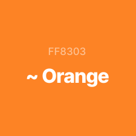
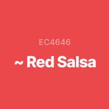
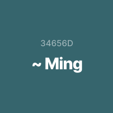
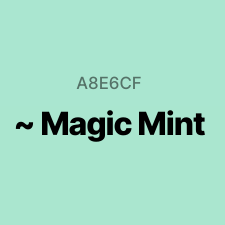
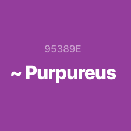
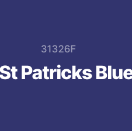

MILESTONE PROJECT TWO - USER INTERACTIVE 
# Haikyū! - anime series player cards and quiz

This project features a website based on the manga and anime series Haikyū!, featuring the teams that are important to the plot of the story. Interacting with the panels on the homepage will bring the user to information about the teams, starting line-up player cards and team quiz. 

This project can be viewed live here : [Haikyū!](https://finnsterfran.github.io/Haikyuu-anime-quiz-page/)

# UX

# User Story 

## Visitor to the website 
* I am a fan of the anime and I want to test my knowledge of the teams.
* I watched the anime and would like to match the player's faces to their names. 

### These goals are accomplished via: 
* Player cards in the panel feature an image, name, position and year of each starting line-up player for the teams.
* A 10-question quiz for each team. 

# 1. Strategy
* The target users to this website are fans or would-be fans. 
* The website should be visually appealing - simple yet fun.
* Player cards and team information should provide some leads to the quiz answers.

# 2. Scope
* Panels to host the players cards and team information.
* Information in the panels help with answering questions in the quiz.

# 3. Structure
* Consistant features on the homepage and quiz pages are:
    * logo at the top 
    * site storyline below the logo
* Essentially just two pages - homepage and quiz pages

# 4. Skeleton 
* No header or footer navigation buttons on homepage
* Logo on quiz page is clickable and returns user to homepage

* Wireframes: 

    * Desktop with first panel active

    

    * Desktop with second panel active

    

    * Desktop quizpage

    

    * Tablet homepage

    

    * Tablet quizpage

    

    * Mobile homepage

     

    * Mobile quizpage

    

# 5. Surface

## Colors:
* The background for all pages is *whitesmoke*

* Color for Karasuno:

     
* Color for Nekoma:

    

* Color for Datekōgyō:

    

* Color for Aoba Jōsai:

    

* Color for Shiratorizawa:

    

* Color for Fukurōdani:

    

## Typography:
### "Courier New" font family was used for the entire website.

# Features

## Existing Features
* Panels that slide open upon clicking. 
* Player cards 
* Repeatable quiz 

## Features to consider implementing in the future
* Short video clips of anime
* Memory game - match player with their teams

# Technologies Used 

## Languages 
* HTML5
* CSS3
* JavaScript ES6

## Integration
* [Font Awesome](https://fontawesome.com/)
    * Icon used on website

# Workspace, Version Control and Repository Storage
* [Gitpod](https://gitpod.io/)
* [Github](https://github.com/)
* [Git](https://git-scm.com/)

# Resources

* [Crunchyroll](https://www.crunchyroll.com/en-gb)
    * all images are screenshot snapped from the anime videos 
* [Sneakpeekot](https://sneakpeekit.com/)
    * printable grids used for wirefreams and edited using preview
* [udemy](https://www.udemy.com/)
    * JavaScript course taken here to learn how to make a quiz

# Testing 
* Testing documentation can be found here : [Testing](TESTING.md)

# Deployment 
The deployment process of getting this project on GitHub Pages:
1. The HTML, CSS and JavaScript codes were written on Gitpod, using Code Institute's project template.
    * [Gitpod](https://gitpod.io/) is an online integrated development environment (IDE)
2. I made a new repository on my [GitHub](https://github.com/) account:
    * Click 'New'
    * Choose respository template - Code-Institute-Org/gitpod-full-template
    * Typed in respository's name
    * Clicked on Gitpod button to be transported to a new workspace there
3. Getting codes up to GitHub respository:
    * Saved codes
    * on command line: git add .
    * on command line: git commit -m "commitment message here"
    * on command line: git push 
4. To publish the project to GitHubPages:
    * Clicked on settings in the respository page in GitHub 
    * Under Options to the left, scrolled down to Pages
    * Under Source, I chose Branch: Master and Folder: /(root)
    * Page took awhile to be published
5. This project may be downloaded or cloned:
    * On respository page, select button titled Code
    * Drop down menu will give the option of Clone, Open with GitHub Desktop or Download Zip

# Problem Encountered 
1. Wording on the closed panels were not very readable as they clashed with the images. I tried to do a backdrop-filter: blur(?px) which worked fine but threw an error in the validator.
    * I solved this by changing this to a rgba background for wording.
2. Clicks to get the panel text and cards shared a global clicks variable which caused a collective count of clicks instead of listening for number of clicks in the functions.
    * I solved this by making individual clicks variables for the individual events.
3. Responsivenesss displayed fine when the website was put through the responsive tester but Live testing hit several snags of layout distortion.
    * I added orientations to the breakpoints.

# Credits 

## Code 
* Brad Traversy's course on udemy on making expanding panels - adapted codes to my project's panels.
* James Quick's course on udemy on making a quiz app - adapted codes to my quiz.

# Acknowledgement 
* My mentor Excellence Illesanmi for his mentoring from project start to finish line. 

# Commits 
#### Commit May 12, 2021
1. Initialized the project 

#### Commits May 15, 2021
1. Create folders - Assets > CSS, images, JS. Create files - html files, css stylesheets, scripts 
2. Make changes to classes in index.html and add style to panels in styles.css. Add onclick to load information text in first panel
3. Add player cards to karasuno panel in script.js 
4. Add player cards to nekoma panel in script.js
5. Add player cards to datekogyo panel in script.js

#### Commits May 16, 2021
1. Add player cards to shiratorizawa and aobajosai in script.js
2. Add player cards to fukurodani in script.js

#### Commit May 17, 2021
1. Add elements to karasuno.html and styling to quiz.css

#### Commits May 18, 2021
1. Change h6 tag in header to h2 and h6 tag in footer to h3. Add backdrop-filter to h3 in panels to make the words more readable. Decrease width of h3 in active panel. 
2. Add script for quiz to karasuno.js. Make adjustments to karasuno.html, remove the home-icon and make it appear only after quiz message appears. Make changes to quiz.css and style css. Score message line height increase. Question margin decreased.
3. Make changes to styles.css to comply with css validator. remove :root, change colors from var() to #color.
4. Change background property for h3 in panel to be hidden in active state and hidden in information panel when inactive. 
5. Implemented nekoma quiz in nekoma.js and nekoma.html. fix home icon color in css."
6. Add datekogyo.js and datekogyo.html
7. Change the colors of the team pages buttons in the panels
8. Add aobajosai.js and aobajosai.html
9. Add shiratorizawa.js and shiratorizawa.html
10. Add fukurodani.js and fukurodani.html, change quiz font color to white to provide contrast with background.
11. Minor changes to quiz and player description typos

#### Commits May 21, 2021
1. Update and add images to ReadMe.md
2. Update ReadMe.md
3. Add media query for screen max-width: 768px. Update img for Inuoka in nekoma (sizing was wrong), fixed overlapping words in script.js

#### Commits May 23, 2021
1. Add media query for screen laptop, tablet and mobile to quiz.css

#### Commits May 24, 2021
1. Amend media query for quiz.css for laptop, tablet and mobile screens. 
2. Make slight changes to styles.css media-query for max-width: 768px
3. Make slight changes for media query max-width: 320px
4. Add images for ReadMe.md
5. Change clicks variables for each team in script.js. change class from social to copyright
6. Add missing = sign in script.js
7. Change first letter of png files for ReadMe.md to lowercase.

#### Commits May 25, 2021 
1. Add favicon to all html pages. Change color for incorrect answer to #FFB0B0 for better contrast when playing nekomaquiz
2. Fix problems loading js on published website by adding . in front of the path.\
3. Fix alignment of paragraphs for mobile view
4. Fix alignment of paragraphs for tablet view
5. Fix color for button that seemed to have disappeared in published view
6. Make changes to screen devices sizing because the published website does not appear in proper alignment on some small devices
7. Adjust responsive sizing, does not seem to register breakpoint for iPad
8. More adjustment to responsibe sizing as gitpod live-server seems to differ from published website
9. More minor responsive adjustments
10. More minor responsibe adjustments
11. Change font-size in infotext to make it fit in screensize on iphone second
12. Change padding on infotext styles.css
13. Change paragraph text for nekoma in script.js
14. Documentation update in TESTING.md. Minor changes to styles.css for mediaquery orientations
15. Test - locking orientation of device screen (this does not work)
16. Add mediaquery for landscape view on tablet
17. Make adjustments to landscape view on tablet
18. More adjustments to landscape view on tablet
19. Fix responsiveness to the smallest viewport media query
20. Adjust panel size to fit the wordings for viewport 320px
21. Font-size change for funfact in mobile size
22. change font-size for players'cards mobile screensize

#### Commits May 26, 2021
1. Remove orientation: portrait for min-max: 320px 
2. Update and add images to TESTING.md and margin change for 320px screen
3. Minor adjustments to margin for teamTextBox in styles.css - aobajosai quiz button doesn't show properly
4. Make slight adjustment to teamTextBox- margin change
5. Update README.md and TESTING.md. Resize some images for TESTING.md
6. Final commit. Update README.md

