MILESTONE PROJECT TWO - USER INTERACTIVE 
# Haikyū! - anime series player cards and quiz

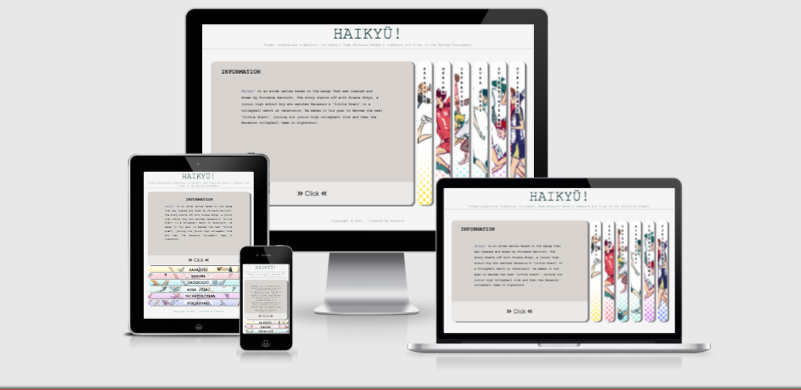
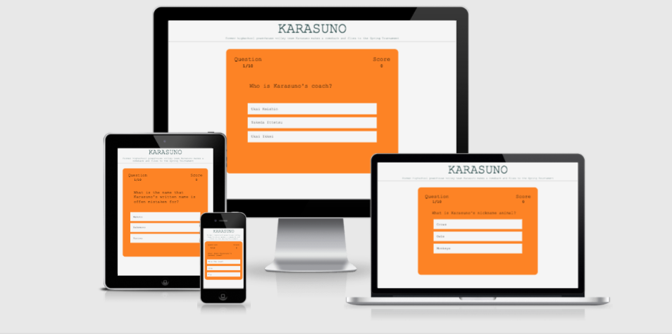

#### This project features a website based on the manga and anime series Haikyū!, featuring the teams that are important to the plot of the story. Interacting with the panels on the homepage will bring the user to information about the teams, starting line-up player cards and team quiz. 
# Table of Content 

1.  [UX](#UX)
    *   [User Story](#UserStory)
    *   [Stratergy](#Strategy)
    *   [Scope](#Scope)
    *   [Structure](#Structure)
    *   [Skeleton](#Skeleton)
        * [Wireframes](#Wireframes)
    *   [Surface](#Surface)
        * [Colors](##Colors)
        * [Typography](##Typography)

2.  [Features](#Features)
    *   [Existing Features](#ExistingFeatures)
    *   [Features in the future](#Featuresinthefuture)

3.  [Technologies](#Technologies)
    *   [Languages](#Languages)
    *   [Integration](#Integrations)
    *   [Workspace](#)

    

# UX

# User Story 

## Visitor to the website 
* I am a fan of the anime and I want to test my knowledge of the teams.
* I watched the anime and can't match the player's name to the player's face. 

### These goals are accomplished via: 
* Player cards in the panel feature an image, name, position and year of each starting line-up player for the teams.
* A three-choice multiple question quiz for each team.

# 1. Strategy
* The target users to this website are fans or would-be fans. 
* The website should be visually appealing - simple yet fun.
* Player cards and team information should provide some leads to the quiz answers.

# 2. Scope
* Panels to host the players cards and team information.
* Information in the panels help with answering questions in the quiz.

# 3. Structure
* Consistant features on the homepage and quiz pages are:
    * logo at the top 
    * site storyline below the logo
* Essentially just two pages - homepage and quiz pages

# 4. Skeleton 
* No header or footer navigation buttons on homepage
* Logo on quiz page is clickable and returns user to homepage

* Wireframes: 

    * Desktop with first panel active

    

    * Desktop with second panel active

    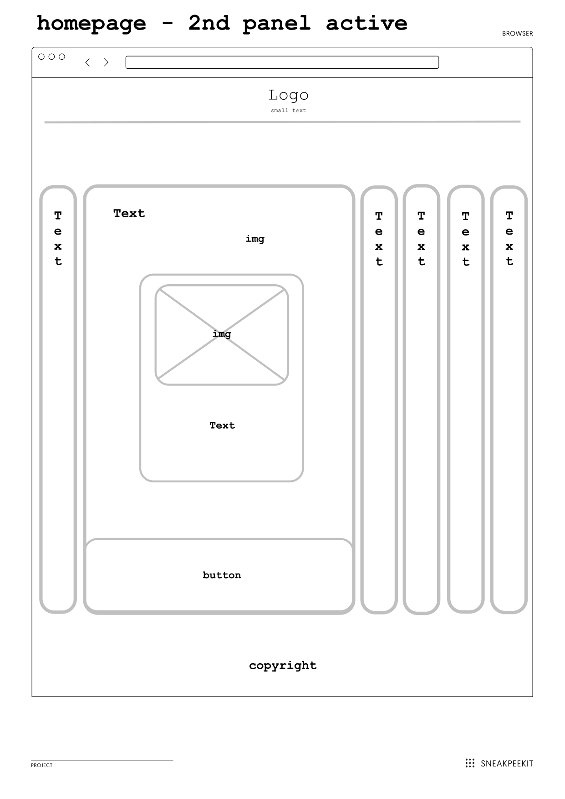

    * Desktop quizpage

    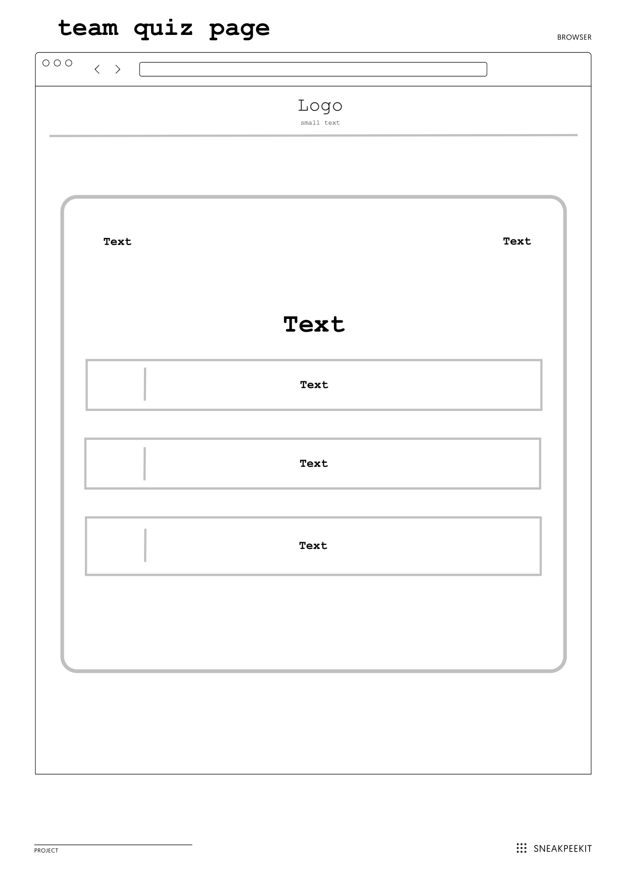

    * Tablet homepage

    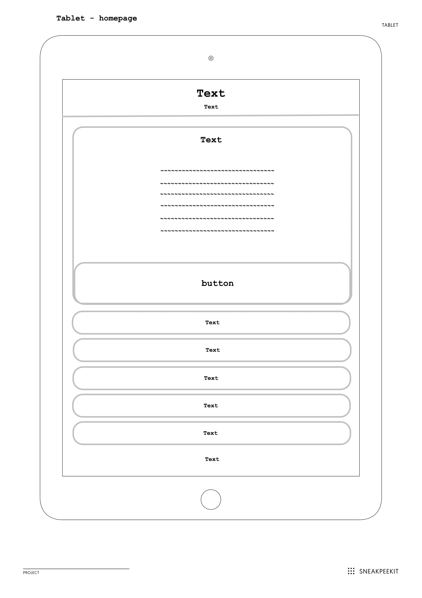

    * Tablet quizpage

    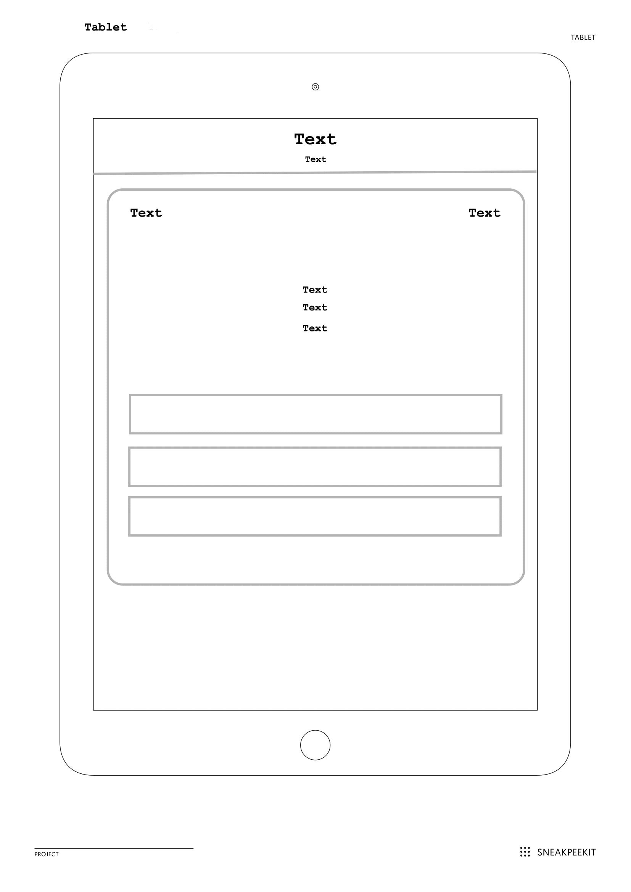

    * Mobile homepage

    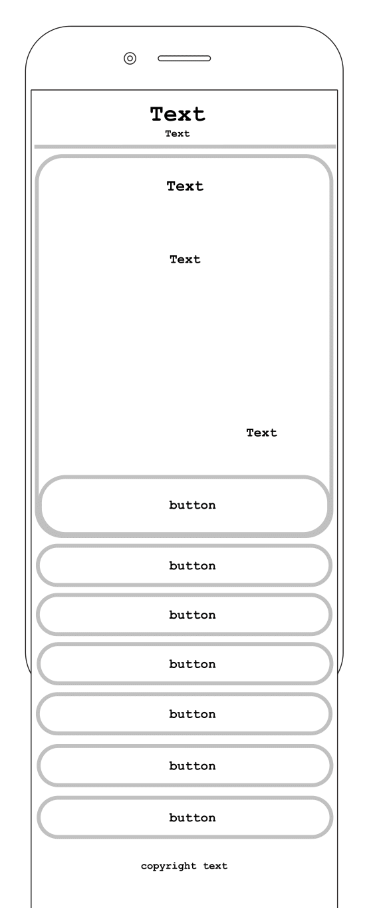 

    * Mobile quizpage

    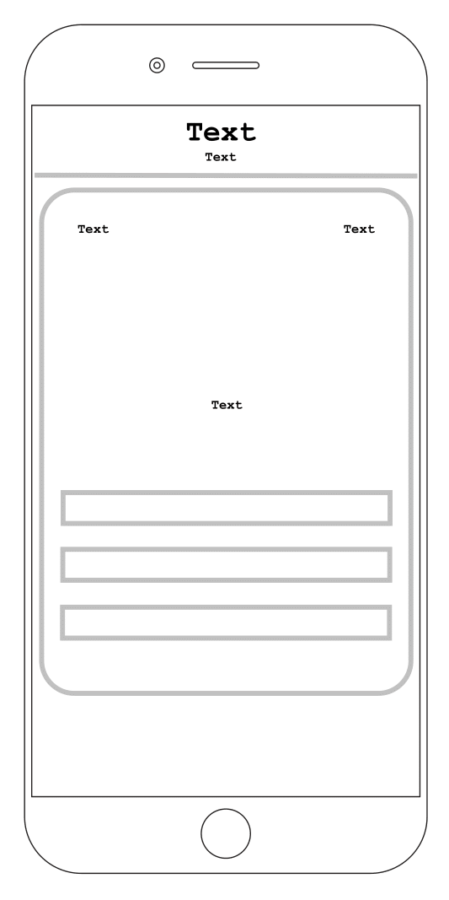

# 5. Surface

## Colors:
* The background for all pages is *whitesmoke*

* Color for Karasuno:

    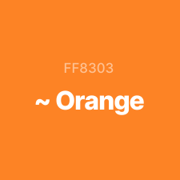 
* Color for Nekoma:

    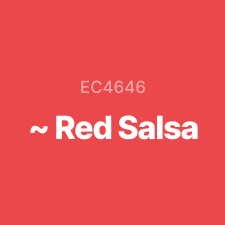

* Color for Datekōgyō:

    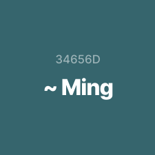

* Color for Aoba Jōsai:

    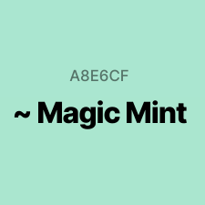

* Color for Shiratorizawa:

    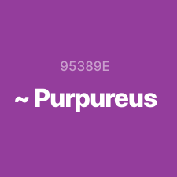

* Color for Fukurōdani:

    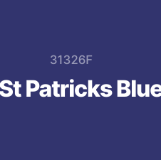

## Typography:
### "Courier New" font family was used for the entire website.

#

# Features

## Existing Features
* Panels that slide open upon clicking. 
* Player cards 
* Repeatable quiz 

## Features to consider implementing in the future
* Short video clips of anime
* Memory game - match player with their teams

# Technologies Used 

## Languages 
* HTML5
* CSS3
* JavaScript ES6

## Integration
* [Font Awesome](https://fontawesome.com/)
    * Icon used on website

# Workspace, Version Control and Repository Storage
* [Gitpod](https://gitpod.io/)
* [Github](https://github.com/)
* [Git](https://git-scm.com/)

# Resources

* [Crunchyroll](https://www.crunchyroll.com/en-gb)
    * all images are screenshot snapped from the anime videos 
* [Sneakpeekot](https://sneakpeekit.com/)
    * printable grids used for wirefreams and edited using preview
* [udemy](https://www.udemy.com/)
    * JavaScript course taken here to learn how to make a quiz

# COMMITS 
#### Commit May 12, 2021
1. Initialized the project 

#### Commits May 15, 2021
1. Create folders - Assets > CSS, images, JS. Create files - html files, css stylesheets, scripts 
2. Make changes to classes in index.html and add style to panels in styles.css. Add onclick to load information text in first panel
3. Add player cards to karasuno panel in script.js 
4. Add player cards to nekoma panel in script.js
5. Add player cards to datekogyo panel in script.js

#### Commits May 16, 2021
1. Add player cards to shiratorizawa and aobajosai in script.js
2. Add player cards to fukurodani in script.js

#### Commit May 17, 2021
1. Add elements to karasuno.html and styling to quiz.css

#### Commits May 18, 2021
1. Change h6 tag in header to h2 and h6 tag in footer to h3. Add backdrop-filter to h3 in panels to make the words more readable. Decrease width of h3 in active panel. 
2. Add script for quiz to karasuno.js. Make adjustments to karasuno.html, remove the home-icon and make it appear only after quiz message appears. Make changes to quiz.css and style css. Score message line height increase. Question margin decreased.
3. Make changes to styles.css to comply with css validator. remove :root, change colors from var() to #color.
4. Change background property for h3 in panel to be hidden in active state and hidden in information panel when inactive. 
5. Implemented nekoma quiz in nekoma.js and nekoma.html. fix home icon color in css."
6. Add datekogyo.js and datekogyo.html
7. Change the colors of the team pages buttons in the panels
8. Add aobajosai.js and aobajosai.html
9. Add shiratorizawa.js and shiratorizawa.html
10. Add fukurodani.js and fukurodani.html, change quiz font color to white to provide contrast with background.
11. Minor changes to quiz and player description typos

#### Commits May 21, 2021
1. Update and add images to ReadMe.md
2. Update ReadMe.md
3. Add media query for screen max-width: 768px. Update img for Inuoka in nekoma (sizing was wrong), fixed overlapping words in script.js

#### Commits May 23, 2021
1. Add media query for screen laptop, tablet and mobile to quiz.css

#### Commits May 24, 2021
1. Amend media query for quiz.css for laptop, tablet and mobile screens. 
2. Make slight changes to styles.css media-query for max-width: 768px
3. Make slight changes for media query max-width: 320px
4. Add images for ReadMe.md

