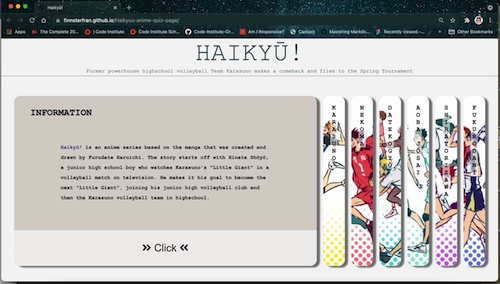
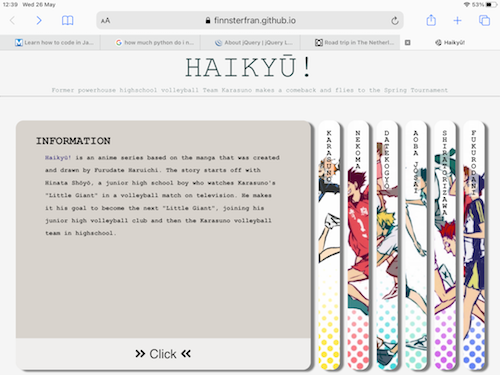
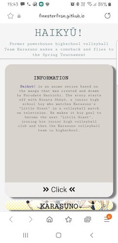
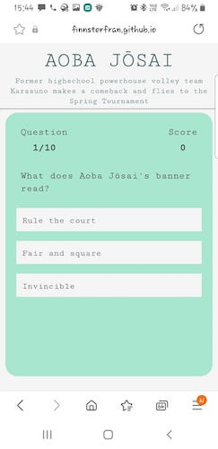
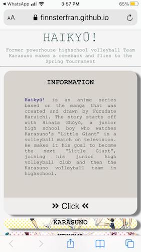
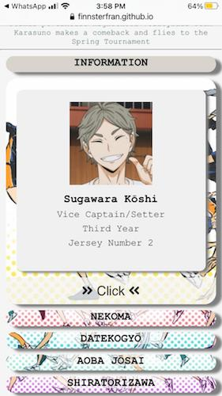

#Testing 

## HTML - Codes were put through [W3Validator](https://validator.w3.org/)
* index.html - Document checking completed. No errors or warning to show.
* karasuno.html - Document checking completed. No errors or warning to show.
* nekoma.html - Document checking compeleted. No errors or warning to show.
* datekogyo.html - Document checking completed. No errors or warning to show. 
* aobajosai.html - Document checking completed. No errors or warning to show.
* shiratorizawa.html - Document checking completed. No errors or warning to show.
* fukurodani.html - Document checking completed. No errors or warning to show.

## CSS - Codes were put through [CSS-Validator](https://jigsaw.w3.org/css-validator/validator)
* styles.css - No Error Found.
* quiz.css - No Error Found.

## JavaScript - Codes were put through two validators 
1.  [ES6 Syntax Check](https://www.piliapp.com/syntax-check/es6/) 
    * script.js - Good! There is no error!
    * karasumo.js - Good! There is no error!
    * nekoma.js - Good! There is no error!
    * datekogyo.js - Good! There is no error!
    * aobajosai.js - Good! There is no error!
    * shiratorizawa.js - Good! There is no error!
    * fukurodani.js - Good! There is no error!

2. [JSHint](https://jshint.com/)
    * script.js - Script threw 51 warnings in relation to discovery of ES6 syntax in codes (e.g. arrow function, const). 
    * karasuno.js, nekoma.js, datekogyo.js, aobajosai.js, shiratorizawa.js, fukurodani.js - Scripts threw 33 warngins in relation to discovery of E26 syntax in codes (eg. arrow function. temperal literal, let, const)

## Lighthouse - Developer Tool in Chrome
1. Device - Desktop for Best Practices, Accessiblity, SEO
    * index.html - 100, 100, 100
    * karasuno.html - 100, 100, 100
    * nekoma.html - 100, 100, 100
    * datekogyo.hmtl - 100, 100, 100
    * aobajosai.html - 100, 100, 100
    * shiratorizawa.html - 100, 100, 100
    * fukurodani.html - 100, 100, 100

2. Device - Mobile for Best Practices, Accessiblity, SEO
    * index.html - 100, 100, 100
    * karasuno.html - 100, 100, 100
    * nekoma.html - 100, 100, 100
    * datekogyo.hmtl - 100, 100, 100
    * aobajosai.html - 100, 100, 100
    * shiratorizawa.html - 100, 100, 100
    * fukurodani.html - 100, 100, 100

## Testing User Story
1. I am a fan of the anime and I want to test my knowledge of the teams.
    * There are 6 quizzes I can do, a quiz each for the different teams. 
    * There are 10 questions in each quiz.
    * The correct answer was highlighted in green and the incorrect answer was highlighted in red, so I was aware of which questions I got wrong.

2. I watched the anime and would like to match the player's faces to their names. 
    * The individual panels on the homepages opens to show cards of the players from each team.
    * The cards showed the images of the players and their names.

## Manual Testing on Published website
* Homepage
    * Homepage load as it should. 
    * Panels open and close on clicking.
    * Cards with panel load on clicking of button.
    * Pages Button within panel opens to team quiz pages.
    * Reload buttons reload page.

* Quizpage 
    * Quiz questions load as they should.
    * Question counter updates as each question appears.
    * Score increases when answer is correct.
    * Correct answer highlights in green.
    * Incorrect answer hightlights in red.
    * Reload and home-icon buttons appear after quiz is completed.
    * Clicking reload button reloads the quiz.
    * Clicking home-icon button brings user back to homepage.

## Live Testing - Laptop, Tablet, Mobile
1. Laptop - Apple air 13inch 

    

2. Tablet - Apple iPad

    

3. Mobile - 
    * Samsung Note 8

     

    * Apple iPhone 7 

     
